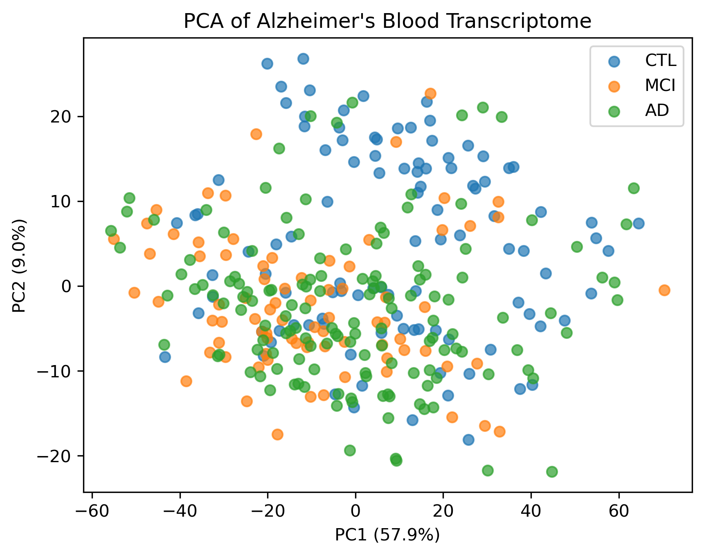
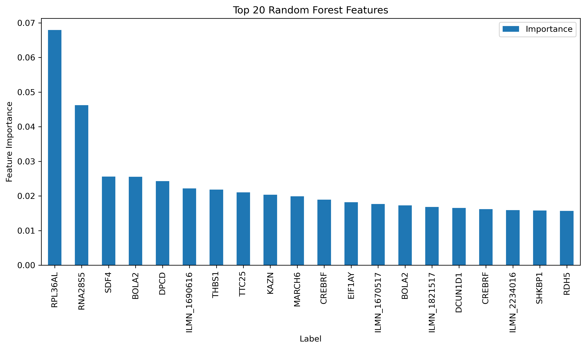

# Alzheimer's Disease Progression Biomarker Discovery Using Blood Transcriptomics
### Project Summary
Alzheimer's disease (AD) is a progressive neurodegenerative disorder for which reliable blood-based biomarkers remain limited. Early identification of molecular changes associated with disease progression could improve diagnosis, patient stratification, and therapeutic monitoring.
This project presents an end-to-end transcriptomic biomarker discovery pipeline using whole-blood gene expression profiles from the AddNeuroMed cohort (GSE63060). Statistical analysis, progression modeling, and machine learning were integrated to identify genes exhibiting consistent expression changes across the disease continuum: 
#### Control → Mild Cognitive Impairment → Alzheimer's Disease
Starting from 48,804 transcriptomic probes, the analysis identified 52 progression-associated genes and prioritized 14 high-confidence biomarker candidates supported by both statistical significance and machine-learning feature importance.
## Project Highlights

| Dataset Scale | Result |
|---------------|--------|
| 👥 Samples | 326 |
| 🧬 Expression Probes | 48,804 |
| 📊 Significant Probes (FDR) | 3,647 |
| 🔍 Progression Probes | 66 |
| 🧬 Unique Progression Genes | 52 |
| ⭐ Final Biomarker Candidates | 14 |

### Key Outcomes

- Identified **3,647 significantly altered probes** across CTL, MCI, and AD groups.
- Discovered **52 genes exhibiting consistent disease progression patterns**.
- Prioritized **14 high-confidence biomarker candidates** using statistical analysis and machine learning.
- Demonstrated that blood transcriptomic profiles contain detectable signatures of Alzheimer's disease progression.
### Final biomarker Candidates
 | Gene symbol   | Gene title                                            | Direction   |   Change |   Importance |
|:--------------|:------------------------------------------------------|:------------|---------:|-------------:|
| RPL36AL       | ribosomal protein L36a like                           | down        | 0.739503 |    0.0679143 |
| RNA28S5       | RNA, 28S ribosomal 5                                  | up          | 1.21564  |    0.0462421 |
| SDF4          | stromal cell derived factor 4                         | down        | 0.278686 |    0.0256044 |
| BOLA2         | bolA family member 2                                  | up          | 0.305497 |    0.0255301 |
| DPCD          | deleted in primary ciliary dyskinesia homolog (mouse) | down        | 0.121868 |    0.0242657 |
| THBS1         | thrombospondin 1                                      | up          | 0.238507 |    0.0218365 |
| TTC25         | tetratricopeptide repeat domain 25                    | down        | 0.211199 |    0.0210014 |
| KAZN          | kazrin, periplakin interacting protein                | up          | 0.150143 |    0.0203477 |
| MARCH6        | membrane associated ring-CH-type finger 6             | up          | 0.349951 |    0.0199152 |
| EIF1AY        | eukaryotic translation initiation factor 1A, Y-linked | down        | 0.500557 |    0.0181843 |
| DCUN1D1       | defective in cullin neddylation 1 domain containing 1 | up          | 0.244576 |    0.0165488 |
| CREBRF        | CREB3 regulatory factor                               | up          | 0.311732 |    0.0161718 |
| SHKBP1        | SH3KBP1 binding protein 1                             | up          | 0.262063 |    0.015802  |
| RDH5          | retinol dehydrogenase 5                               | up          | 0.155796 |    0.015669  |

### Research Question
Can blood gene expression profiles identify molecular biomarkers associated with Alzheimer's disease progression from healthy aging through mild cognitive impairment to clinically diagnosed Alzheimer's disease?

| Attribute  | Value                  |
| ---------- | ---------------------- |
| Dataset    | GSE63060               |
| Cohort     | AddNeuroMed            |
| Platform   | Illumina HumanHT-12 V3 |
| Samples    | 326                    |
| Features   | 48,804 probes          |
| Conditions | CTL, MCI, AD           |
## Methodology
#### Data Preprocessing
Quality assessment of expression profiles
Variance-based feature filtering
Probe-to-gene annotation using GPL6947 platform data
#### Exploratory Analysis
#### Principal Component Analysis 
PCA was performed to evaluate global transcriptomic structure and disease-related variance.
| Principal Component | Variance Explained |
| ------------------- | -----------------: |
| PC1                 |              57.9% |
| PC2                 |               9.0% |
| Total               |              66.9% |

The substantial overlap between CTL, MCI, and AD samples suggests that disease-associated expression changes occur within a highly heterogeneous biological background.

#### Differential Expression Analysis
One-way ANOVA was performed across all disease groups followed by False Discovery Rate correction.
| Stage              | Probes |
| ------------------ | -----: |
| Initial Features   | 48,804 |
| Significant Probes |  3,647 |

##### Disease Progression Modeling
Genes were screened for monotonic expression trends across disease stages:
Upregulated progression genes
CTL < MCI < AD

Downregulated progression genes
CTL > MCI > AD
Genes were ranked according to absolute expression change between Control and Alzheimer's disease groups.
| Metric                        | Count |
| ----------------------------- | ----: |
| Progression-associated Probes |    66 |
| Unique Genes                  |    52 |

### Machine Learning Validation
Random Forest classification was used to evaluate whether progression-associated genes contain predictive information regarding disease status.
Classification Task:
CTL vs MCI vs AD
Cross-validation performance:
| Metric   | Score |
| -------- | ----: |
| Accuracy |   54% |
Feature importance analysis was subsequently used to prioritize biologically relevant biomarkers.

## Key Results
### Biomarker Discovery Funnel
48,804 probes
      ↓
3,647 significant probes
      ↓
66 progression-associated probes
      ↓
52 unique genes
      ↓
14 high-confidence biomarker candidates

High-Confidence Biomarker Candidates
| Gene    | Regulation |
| ------- | ---------- |
| RNA28S5 | Up         |
| RPL36AL | Down       |
| EIF1AY  | Down       |
| MARCH6  | Up         |
| BOLA2   | Up         |
| TTC25   | Down       |
| SDF4    | Down       |
| DCUN1D1 | Up         |
| SHKBP1  | Up         |
| CREBRF  | Up         |
| THBS1   | Up         |
| RDH5    | Up         |
| KAZN    | Up         |
| DPCD    | Down       |
#### These genes demonstrated:
Statistical significance after multiple-testing correction
Consistent disease progression trends
Predictive relevance according to Random Forest feature importance
### Technical Skills
#### Bioinformatics
Transcriptomic data analysis

Gene annotation

Differential expression analysis

Biomarker discovery workflows
#### Statistics
ANOVA

Multiple-testing correction (FDR)

Variance analysis

Feature selection

#### Machine Learning

Random Forest classification

Cross-validation

Feature importance analysis

Biomarker prioritization

#### Python Ecosystem

Pandas

NumPy

SciPy

Scikit-learn

Matplotlib

#### Project Impact
This project demonstrates a reproducible computational framework for biomarker discovery in neurodegenerative disease. By combining statistical analysis with machine learning, the workflow narrows thousands of transcriptomic features into a focused set of candidate biomarkers for future biological validation.

### Limitations: 
Findings are derived from a single transcriptomic cohort and should be considered candidate biomarkers until validated in independent datasets and experimental studies.

## Future Work
Pathway enrichment analysis

Gene set enrichment analysis (GSEA)

External validation on independent Alzheimer's cohorts

Explainable AI approaches (SHAP values)

Biomarker panel optimization for early-stage prediction
